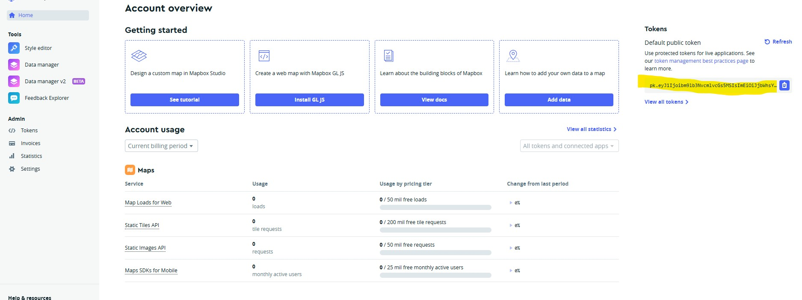
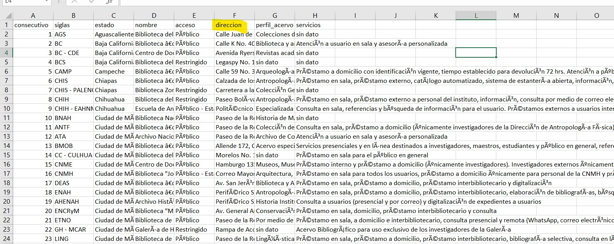
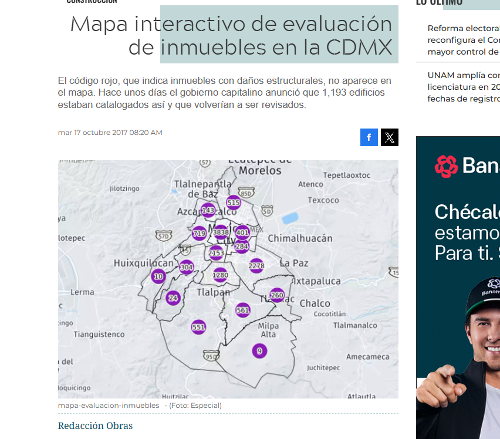
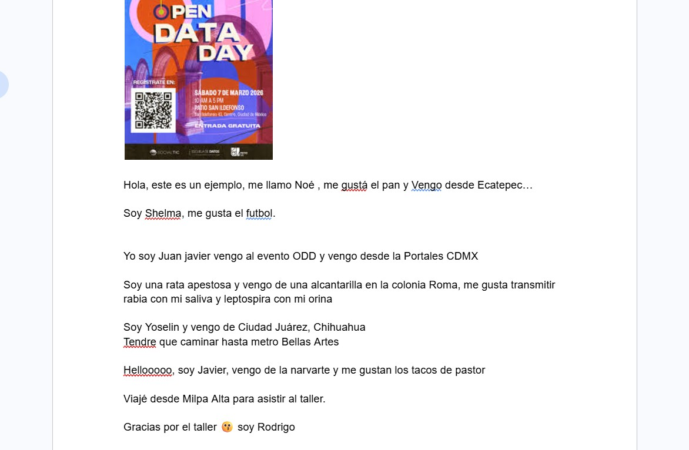

```{r include=FALSE}
#| message: false
library(tidyverse)
library(sf)
library(leaflet)
library(mapview)
library(jsonlite)
library(gt)
library(ellmer)
```


# Introducción


OpenDataDay, Como descargar información desde el portal del [INEGI](https://www.inegi.org.mx/servicios/catalogoUnico.html).

# Parte 1: Datos Espaciales

En esta parte usaremos las siguientes librerías: tidyverse manipulación de datos, sf para lectura/manipulación de datos espaciales (vectoriales) mapview para una visualización sencilla. en caso de que no las tengas puedes usar el comando 
"install.packages("acá el nombre de la librerías que vas a instalar")" por ejemplo: *install.packages("sf")* y ejecutar la función.

Una vez instaladas, es necesario llamarlas.

```{r eval=FALSE}
library(tidyverse)
library(sf)
library(mapview)
```

En el portal del INEGI, aparte de sus API'S como DENUE, banco de indicadores y el sistema de Ruteo (sakbe), podemos obtener directamente datos espaciales de México.

AlgunAs de ellAs lo haremos aplicados al Estado de Tlaxcala (por rápidez ya que es el más pequeño), puedes consultar acá las claves de la Entidad [Catalogo Entidades](https://www.agricultura.gob.mx/sites/default/files/sagarpa/document/2018/07/17/8/180717115914/entidades-federativas.pdf) y los datos que puedes obtener son:
Área Geoestadística Estatal, Área Geoestadística Municipal, Localidad Geoestadística, Asentamientos o Vialidades

* Areas Geoestadísticas Estatales (Recuerda que los últimosdigitos corresponden al Estado a DOS CIFRAS)
  *  https://gaia.inegi.org.mx/wscatgeo/v2/geo/mgee/*29*
* Áreas Geoestadísticas Municipales 
  * https://gaia.inegi.org.mx/wscatgeo/v2/geo/mgem/*29*
* Por ageb
  * https://gaia.inegi.org.mx/wscatgeo/v2/geo/agebu/*29*
* Por manzana
  * https://gaia.inegi.org.mx/wscatgeo/v2/geo/mza/*29*
* Vialidades OJO,vialidades es el único que no puede obtenerse anivel Edo, por lo que acá debes especificar el municipio (nada que soluciones un loop para cargar todo el estado)
  * https://gaia.inegi.org.mx/wscatgeo/v2/geo/vialidades/*29*/*001*

*TIP*

Los datos o los links de arriba regresan un archivo geojson, para que devuelva solo como formato de tabla borra la palabra *geo* del link

* geojson: https://gaia.inegi.org.mx/wscatgeo/v2/geo/mgee/*29*
* json   : https://gaia.inegi.org.mx/wscatgeo/v2/mgee/*29*


Para cada consulta es un link diferente o puede ser el mismo link pero se van agregando parámetros, acá te muestro como generar algunos de forma sencilla, pero puedes ver todos los ejemplos en el portal de servicios web en Guía para desarrolladores en el [Catálogo Único de Claves Geoestadísticas](https://www.inegi.org.mx/servicios/catalogoUnico.html).

## Entidades.

Le información que puedes consultar está tanto en formato tabla(json) ó "espacial" (geojson). 
El primer ejemplo (y único) para *Tabla* (json) leeremos la información de población a nivel nacional. 

*Ojo que algunas veces ocupo las librerías de esta forma: "nombre::función"* 

Lo hago así ya que no quiero llamar a toda la librería únicamente a esa función. Acá la función viene de la librería jsonlite y la función "fromJSON" es la que lee ese tipo de archivos

```{r}
pob_nal = jsonlite::fromJSON(
  "https://gaia.inegi.org.mx/wscatgeo/v2/mgee/",
  flatten = TRUE
  )
```

Al hacer esta consulta nos devuelve un objeto tipo lista que contiene 3 elementos: *datos*, *metadatos*, *numReg*

```{r}
str(pob_nal)
```

* Datos Es la tabla de las entidades con variables de población,
* Metadatos contiene de donde obtuvo la información ("INEGI. Censo de Población y Vivienda, 2020")
* numReg indica la cantidad de registros que nos devolvió (32, por que son 32 entidades)

por default (en json) suelen venir todo en tipo texto, así que pasaremos a numérico las variables y sobreeescribiremos el objeto *pob_nal* y ya podemos ver los Estados son sus variables (por facilidad solo muestro 10)

```{r}
pob_nal = pob_nal$datos %>% 
  mutate(across(c(pob_total:total_viviendas_habitadas),~as.numeric(.)))

pob_nal %>% head(10)
```

Usango gt podemos hacer una tabla sencilla y rápida con los primeros 10 registros.

```{r}
pob_nal %>% 
  arrange(desc(total_viviendas_habitadas)) %>% 
  head(10) %>% 
  gt() %>% 
    fmt_number(
    columns = c("pob_total":"total_viviendas_habitadas"),
    decimals = 0,
    use_seps = TRUE
  ) %>% 
    data_color(
    columns = total_viviendas_habitadas,
    method = "numeric",
    palette = "viridis"
  ) %>% 
    cols_label_with(
      fn = ~ html(str_to_title(gsub("_", "<br>", .x)))
    )
```

## Datos espaciales

Como puedes ver solo leímos un link y fue sencillo de obtener, no necesitamos ningún token para poder leer la información, pero bueno ahora sí a leer datos espaciales (al fin!) ¿Recuerdas la Guía para desarrolladores? en el [Catálogo Único de Claves Geoestadísticas](https://www.inegi.org.mx/servicios/catalogoUnico.html) cada información que indica, menciona que puedes obtener la información vectorial en formato geojson, puede ser ya sea a nivel nacional o información por Estado municipio, Ageb ,acá presentaremos algunos ejemplos

## Estados

Para leer Una entidad en específico debemos armar un link. de la siguiente forma:

*https://gaia.inegi.org.mx/wscatgeo/v2/geo/mgee/*{cve_ent}*

Donde dice *cve_ent* es donde se debe reemplazar por un número del 1 al 32 para asignar los Estados, Algunos que me sé de memoria, 1 aguascalientes, el 15 Edo Mex, 09 CDMX, 32 Zacatecas etc.. Ojo que la clave del Estado debe ir *a dos cifras*, o sea si ponemos CDMX tendría que ser "09", Puedes consultar las entidades acá [CATÁLOGO DE ENTIDADES FEDERATIVAS](https://www.agricultura.gob.mx/sites/default/files/sagarpa/document/2018/07/17/8/180717115914/entidades-federativas.pdf) y para hacernos la consulta sencilla lo dividimos en 2, el link_base y el estado que solo se lo pegamos. Haré el ejercicio con la clave 11 (Guanajuato)

Este es el link al que se hará la consulta:

```{r}
link_base = "https://gaia.inegi.org.mx/wscatgeo/v2/geo/mgee/"

paste0(link_base,"29")
```

y con la función st_read() (de la librería sf) leemos el link

```{r}
# st_read viene de la librería sf

estado = st_read(
  paste0(link_base,"11"),
  quiet = TRUE
)
```

¿Qué devuelve esta consulta?

Nos regresa un objeto espacial que contiene las variables: de Nombre del Estado, Población total, femenina, masculina y el total de viviendas habitadas (todo esto del último censo de población del 2020)

```{r}
estado 
```

En R hay muchas formas de visualizar, plot, leaflet, con mapview puedes hacer la visualización dinámica.

```{r}
mapview(estado)
```

*Recuerda que cuando leemos json lo lee todo como formato de texto.*

Ahora intentemos con municipios, al hacer la misma opoeración ahora con el link de municipios y visualizarla a Cada alcaldía le asignó un color distinto, esto es porque está haciendo un "fill" por nombre y no por el valor de viviendas, puedes corroborar esto pasándolo a formato tabla

```{r}
mun = st_read("https://gaia.inegi.org.mx/wscatgeo/v2/geo/mgem/09",quiet=TRUE)

mapview(mun,z="total_viviendas_habitadas")
```

Formato tabla

```{r}
mun %>% as_tibble()
```

pasamos a numérico y sobreescribimos

```{r}
mun = mun %>% mutate(across(c("pob_total":"total_viviendas_habitadas"),as.numeric))
```

```{r}
mapview(mun,z="total_viviendas_habitadas")
```


## Nuevamente Estado

El marco geoestadístico se actualiza cada diciembre aunque en su página indica que la próxima publicación será el 31 de agosto [INEGI MG](https://www.inegi.org.mx/programas/mg/#descargas) . Tal vez te preguntes ¿Bueno pero qué se actualiza? ¿Se agregan más estados? ¿Cuál debo ocupar? y la respuesta es "Depende" Los datos que leemos directamente del link son del último marco Geoestadístico, peero contiene la información del Censo del 2020 así que puedes encontrarte algunos municipios que no tengan información


```{r}
#Guerrero

mun = st_read("https://gaia.inegi.org.mx/wscatgeo/v2/geo/mgem/12",quiet=TRUE)

mun = mun %>% mutate(across(c("pob_total":"total_viviendas_habitadas"),as.numeric))

mapview(mun,z="pob_total")
```

En el mapa se muestran unas zonas en gris, que son municipios que no tiene información, por eso y no es que no tenga población, sino el próximo censo será en el 2030, así que probablemente surjan otros municipios, agebs rurales pasen a urbanos.. etc. Los siguientes Ejercicios los haremos de forma más rápida

## Ejemplo Agebs

solo por diversión, te mostraré a hacer un mapa vibariado, para esto debes tener la librería "bivariateLeaflet"

```{r}
library(bivariateLeaflet)

ageb_tlaxcala = st_read("https://gaia.inegi.org.mx/wscatgeo/v2/geo/agebu/29") %>% 
   mutate(across(c("pob_total":"total_viviendas_habitadas"),as.numeric))

mapa = create_bivariate_map(
  data = ageb_tlaxcala,
  var_1 = "pob_masculina",    # Total population
  var_2 = "pob_femenina"     # Median household income
)

mapa

```


## Ejemplo vialidades

Recuerda que vialidades es el único que no se puede a nivel Entidad así que debes integrar los dígitos del municipio

```{r}
vialidades_tlaxcala = st_read("https://gaia.inegi.org.mx/wscatgeo/v2/geo/vialidades/29/001")

mapview(vialidades_tlaxcala)  
```


# Parte 2: Herramientas para el análisis espacial

En esta sección exploraremos algunas herramientas prácticas que amplían las posibilidades de tu análisis espacial. Algunos ejemplos calcular tiempos de desplazamiento, trazar rutas, y convertir texto en coordenadas (y viceversa).

## Isocronas

Las isocronas delimitan el área alcanzable desde un punto en un tiempo determinado. En lugar de medir distancia en kilómetros (que ignora la infraestructura real) miden distancia en tiempo "real" de desplazamiento a través de vialidades. Ponemos "real" entre comillas ya que la movilidad va más allá de infraestructura, debe considerar la red de transporte, la configuración del terreno, la persona etc.
aprovechando que tenemos los agebs, calculamos el centroide y sobre ese hacemos las isocronas (haremos solo 20 como ejemplo)

```{r}
ageb_tlaxcala = st_read("https://gaia.inegi.org.mx/wscatgeo/v2/geo/agebu/29") %>%
  head(20) %>% 
  mutate(across(c("pob_total":"total_viviendas_habitadas"),as.numeric)) %>% 
  st_centroid() 

mapview(ageb_tlaxcala)
```

Hay varias formas de generar isocronas, de forma rápida podemos usar ya sea con [OSRM](https://project-osrm.org/) o [MapBox](https://walker-data.com/mapboxapi/) Para ambas debes de delimitar.

* Ubicación donde empezará la isocrona
* Modalidad (Caminando, bicicleta o vehículo)
* Tiempo: Al ser movilidad en tiempo, puedes usar un vector o un valor, típicamente se usa 5,10,15

Ejemplo OSRM con un solo punto (No necesitas ningún token), tenemos nuestro punto de partida y el área que podrías llegar en 5 y 15 mnts

```{r}
punto_1 = ageb_tlaxcala[1,]

iso_1 = osrm::osrmIsochrone(
  loc = punto_1, # Donde inicia
  breaks = c(5,15),  #Vector de tiempo
  osrm.profile ="car" # como me voy a mover
  )

mapview(iso_1,z="isomax")+
  mapview(punto_1)
```


con mapbox igual puedes crearlas, desde su api, puedes crear una cuenta de mapbox gratis (si tienes tu correo de universidad es super útil) , puedes crear tu cuenta acá [MapBox](https://account.mapbox.com/auth/signin/?route-to=https%3A%2F%2Fconsole.mapbox.com%2F%3Fauth%3D1)




usa la función mb_acces_token para integrarlo como una variable de entorno.

El token de este ejemplo no es funcional, así que dentro d ela página puedes obtenerlo de forma gratuita, para guardarla como variable de entorno puedes ya sea hacer esta operación o con la librería use_this la función edit_r_environ() agregando el token a "MAPBOX_PUBLIC_TOKEN = ..."

```{r eval=FALSE}
mapboxapi::mb_access_token(token = "pk.eyJ1Ijoi[TU_TOKEN_AQUÍ]",
                           install = TRUE)
```

Ponemos ambas para que puedas compararlas. Hay más servicios y algoritmos, pero estos son dos muy comunes. (OSRM y MapBox)

```{r}
library(mapboxapi)

iso_2 = mb_isochrone(location = punto_1,
             profile = "driving",
             time = c(5,15))


mapview(iso_1)+
  mapview(iso_2,z="time")+
  mapview(punto_1)
```


## Ruteo

El ruteo calcula rutas sobre la red vial entre dos puntos. Ya sea en Encuestas OD o en Distancias Cercanas es útil poder generar las rutas, acá si haremos al menos 10 rutas :) Seguimos con el ejemplo de los Agebs que tenemos como punto y lo separaré en dos objetos los 3 más poblados y veré cuáles son los agebs más cercanos a estas zonas, (hay una librería útil para esto nngeo)

install.packages("nngeo")

```{r}
library(nngeo)

muy_poblados = ageb_tlaxcala %>% arrange(desc(pob_total)) %>% 
  head(5)


nn = st_nn(x = muy_poblados,
           y =ageb_tlaxcala, 
           k = 5, 
           progress = FALSE)

conectar = st_connect(x = muy_poblados,
           y = ageb_tlaxcala,
           ids = nn)

```

Los rojos son lo más poblados y la linea que los conecta son con el punto más cercano

```{r}
library(leaflet)

leaflet() %>% 
  addProviderTiles(providers$CartoDB) %>% 
  addCircleMarkers(data=ageb_tlaxcala) %>% 
  addCircleMarkers(data=muy_poblados,color = "red",opacity = 1) %>% 
  addPolylines(data=conectar)
```

ahora con ruteo, como primer paso es obtener lo más cercanos, con la misma librería y con un spatial join podemos lograrlo. POr facilidad solo me quedé con la variable de cvegeo de ambso objetos, la idea es luego filtrar sus coordenadas y hacer el ruteo, *ORIGEN* se repetirá 3 veces porque es la cantidad que puse de destinos en *k* y destino son los 3 más cercanos. 

```{r}
cercanos = st_join(muy_poblados %>% select(origen = cvegeo), 
        ageb_tlaxcala %>% select(destino=cvegeo), 
        join = st_nn, 
        k = 5, 
        progress = FALSE
        )

cercanos
```

para el ruteo podemos realizarlo con una observación por una con un loop sencillo, pero antes ver si con uno funciona, en el ejercicio cada renglón es un "par" origen Destino, así que vamos a excluir los que su "origen es igual a su destino" ya que ocmo le pasamos todos lso agebs, lo incluye como el más cercano y agregamos una columna llamada "viaje" que es un identificador para el loop

```{r}
base_ruta = cercanos %>% 
  filter(origen!=destino) %>% 
  mutate(viaje=1:n())

base_ruta
```

Para calcular las rutas, primero definimos una función que toma el identificador de cada viaje, filtra el origen y destino en un solo paso con %in%, y obtiene la ruta con mb_optimized_route. Después, usamos map para aplicarla a todos los viajes y list_rbind para combinar los resultados en un solo dataframe. Esto es preferible a un for loop con rbind porque evita recrear el dataframe en cada iteración, lo que se vuelve lento con muchos viajes.


```{r}
obtener_ruta = function(id_viaje) {
  datos = base_ruta %>% filter(viaje == id_viaje)
  
  ageb_tlaxcala %>% 
    filter(cvegeo %in% c(datos$origen, datos$destino)) %>% 
    mb_optimized_route(input_data = ., profile = "walking", output = "sf") %>% 
    pluck("route") %>% 
    mutate(id = id_viaje,
           origen=datos$origen,
           destino=datos$destino)
}

contenedor = map(base_ruta$viaje, obtener_ruta) %>% 
  list_rbind()

```


¿Que nos regresa? una tabla con las geometrías, así que para pasarla un objketo espacial con la función  "%>% 
  sf::st_as_sf()"

```{r}
contenedor
```

y visualizamos 

```{r}
espacial  = contenedor %>% 
  sf::st_as_sf()

espacial
```

```{r}
leaflet() %>% 
  addProviderTiles(providers$CartoDB) %>% 
  addCircleMarkers(data=ageb_tlaxcala) %>% 
  addCircleMarkers(data=muy_poblados,color = "red",opacity = 1) %>% 
  addPolylines(data=conectar,color="black") %>% 
  addPolylines(data=espacial,color="green",opacity = 1)
```


## Geocoding

Convierte direcciones de texto en coordenadas geográficas. Es el primer paso para espacializar bases de datos administrativas: clínicas, escuelas, juzgados, centros de atención a violencia, etc.

Para este ejercicio vamos a usar [*la Plataforma Nacional de Datos Abiertos*](https://www.datos.gob.mx/) los datos de:
*Bibliotecas abiertas al público: Datos sobre la ubicación de las bibliotecas, nombre, dirección y servicios que se ofrecen.*

```{r}
bibliotecas = read.csv("https://repodatos.atdt.gob.mx/api_update/inah/bibliotecas_abiertas_publico/INAH_bibliotecas_abiertas_ok.csv",encoding = "utf8")

glimpse(bibliotecas)
```

El data set No contiene coordenadas pero sí contiene dirección así que con geocoding podemos obtener esas coordenadas.
Dos opciones: 
* tidygeocoding
* mapbox api



Ejemplo con tidygeocoding

Para no ver tantas columnas me quedaré con 2, consecutivo (como identificador y dirección) este es un ejemplo deuna dirección:

*"Calle Juan de Montoro No. 226, Zona Centro, C.P. 20000, Aguascalientes, Aguascalientes."*

Tiene calle, me imagino que colonia, codigo postal, supongo que Municipio y Entidad. Para las funciones hay servicios gratuitos como OpenStretMap (OSM), arcgis y census (este último solo para Estados unidos) , en "method" se puede ajustar. Para este ejemplo le puse "arcgis"

```{r}
library(tidygeocoder)

geo1 = bibliotecas %>%
  select(consecutivo,nombre,direccion) %>% 
  mutate(direccion_completa = paste(direccion, "México")) %>% 
  geocode(address = "direccion_completa",
          method="arcgis",
          lat = "lat",
          long = "lng")

```

Si harás muchos te recomiendo madar por bloques, tipo primero dame 50, esperar unos segundos otros 50 .. etc en el ejemplo hizo las primeras 654

```{r}
geo1 %>% glimpse()
```

y magiaaa... ahora ya tenemos las coordenadas.

```{r}
leaflet() %>% 
  addProviderTiles(providers$CartoDB) %>% 
  addCircleMarkers(data=geo1,label=~nombre)
```

Versión con MapBox

mapbox tiene una función llamada *mb_batch_geocode* que puedes pasarle un dataFrame, pero llega a "romperse" en cas ode que no reconozca una y no decirnos cuál es, así que pasar una por una (como en el ruteo) puede ser buena opción

Tip 2 *si por alguna razón uno falla le agregamos un 'posibly', le pondremos null y saltará al otro es como una implementación del try_catch pero mucho más sencilla*

```{r}

geocodificar_uno_a_uno = function(dir) {
  mb_geocode(
    search_text = dir,
    country     = "MX",
    language    = "ES",
    output      = "sf"
  )
}

geocodificar_safe = possibly(geocodificar_uno_a_uno, otherwise = NULL)

geo2 <- map(bibliotecas$direccion, geocodificar_safe) %>% 
  list_rbind()

```

```{r}
leaflet() %>% 
  addProviderTiles(providers$CartoDB) %>% 
  addCircleMarkers(data=geo1,label=~nombre,color="black") %>% 
  addCircleMarkers(data=geo2,color="red")
```


# Parte 3: Modelos de lenguaje para análisis espacial

## Uso de llm para extraer información de imágenes/fotos

Seguramente te ha pasado que queremos extraer información de mapas ya sea históricos, algun mapa que te gustó y le tomaste una foto o hechos por otras personas pero no tenemos ni el archivo, ni conocemos a la persona o no pudimos contactarla, entonces con ayuda de modelos de lenguaje podemos apoyarnos en extraer la información. POr ejemplo acá hay un mapa (Puedes tomarle foto)



Para usar los modelos de lenguaje en R existen distintas librerías, una que me gusta a mí se llama [ellmer](https://ellmer.tidyverse.org/) , pero antes de iniciar para ocupar modelos de lenguaje tenemos 2 Opciones:

* Usar modelos pequeños de forma local [ollama](https://ollama.com/)
* Usar alguna api, ya sea gratuita o de pago (Acá lo haremos gratis) Ya sea a través de [GitHub](https://github.com/marketplace) o de [Gemini](https://ai.google.dev/gemini-api/docs?hl=es-419) 

Debes guardar las variables en una *variable de entorno* (puedes hacerlo de forma sencilla con la librería [usethis](https://usethis.r-lib.org/) con la función usethis::edit_r_environ()) , se abrirá una ventana y ahí podrás asignar tus variables, una vez que las tengas, las guardarás, cerrarás la pestañas y *reiniciarás* "R" 
Ya sea asi usaste algún llm de github o gemini usaremos la palabra *chat*, (para hacernos la vida un poco facil en este ejercicio ) les llamaremos m1 y m2 

```{r}
library(ellmer)

ellmer::models_google_gemini()
m2 = chat_google_gemini()
```

Una vez que tenemos nuestro modelo podemos verificar si puede "respondernos" 
```{r}
m2$chat("CUentame un chiste breve sobre datos abiertos ")
```

```{r}
m2$chat("se breve, ¿Sabes que esel OpenDataDay?")
```


Ahora sí el vamos a extraer los valores de la imagen.

1.- Necesitamos ya se auna foto/archivo
2.- Una tabla para asignar las variabels 
3.- el chat

La imagen del mapa la guardé en un objeto llamado "i2.png"


```{r}
foto = google_upload(path = "imagen/i2.png")

m2 = chat_google_gemini(system_prompt = "Tu objetivo es ayudarme a extraer los valores")

type_datos = type_object(
id = type_string("Genera un id para cada registro del registro que inicie con 'p_1','p_2','p_3' hasta el limite de registros"),
valor = type_integer("cantidad de valores que observas registrados"),
lat=type_number("integra la latitud del punto valor, la ubicación se encuentra en CDMX Mexico"),
lng=type_number("integra la longitud del punto valor, la ubicación se encuentra en CDMX Mexico")
)

type_final = type_array(items = type_datos)

```


```{r}
resultado = m2$chat_structured(
  foto,
  type = type_final,
  "Extrae todos las cantidades visibles en el mapa así como sus coordenadas"
)
```

```{r}
resultado
```

```{r}
leaflet() %>% 
  addProviderTiles(providers$OpenStreetMap) %>% 
  addCircleMarkers(data=resultado,label = ~scales::comma(valor))
```

"Peor es nada" aunque el prompt fue muy ambiguo  fue un poco "útil" ¿Qué podemos pasarle para mejorar? el límite de la entidad, un prompt mucho mejor, más detallado etc.. pero como primer acercamiento es útil.


## Uso de modelos de lenguaje para información de texto.

¿Te hapasado que quieres extraer información de un texto? estructurarlo, extraer personasjes incluso asignarles características, bueno nos apoyaremos del modelo de lenguaje, Durante el OpenDataDay Hicimos Este ejercicio 




La idea es extraer el texto así como tratar de inferir el género de la persona y las coordenadas de donde viene.
el documento lo puedes descargar de acá [Documento](https://docs.google.com/document/d/1Ndk3tSNzkvTo5ZuraGk_MD6LssePq7SMOnUV9msYquU/edit?tab=t.0)

(por alguna razón le puse de nombre MapBox (1).pdf)

```{r}
archivo = google_upload(path = "imagen/token mapbox (1).pdf")

m2 = chat_google_gemini(system_prompt = "Identifica los nombres en español, asigna el género de la persona, así como sus coordenadas del Archivo")

type_datos = type_object(
  nombre = type_string("Nombre en español de la persona",required = FALSE),
  genero = type_string("Genero que identifiques asociado al nombre",required = FALSE),
  origen=type_string("Indica de donde proviene la persona",required = TRUE),
  lat=type_number("Obten las latitud del origen de la persona",required = TRUE),
  lng=type_number("Obten la longitud del origen de la persona",required = TRUE)
)

type_final = type_array(items = type_datos)
```

Ahor ya que tenemos la estructura así como las variables que nos interesan podemos llamar al modelo nuevamente,  acá usamos una función llamada "requiered" esta es importante ya que si le pones TRUE el modelo se "esforzará" por devolverte algo, para los que no lo tienen puede dejarlos en NULL en caso de que no identifique la información


```{r}
resultado_final = m2$chat_structured(
  archivo,
  type = type_final,
  "Extrae nombres, genero, origen y sus coordenadas del archivo"
)

```

nota improtante la clase de valor debe estar asociada al tipo, por ejemplo type_string son palabras, type number números

```{r}
resultado_final
```

La ventaja de modelos de lenguaje para extraewr información es que podemos ponerles solo una palabra, un sitio y puede asignarle la coordenada.

```{r}
leaflet() %>% 
  addProviderTiles(providers$OpenStreetMap) %>% 
  addCircleMarkers(data = resultado_final,label = ~nombre)
```


# Gracias

Perdón la demora en compartir las notas, espero te sea de utilidad.

Dudas,Quejas,retroalimentación, Reclamos y chistes, siempre feliz de escuchar.

Contactos:

Noé Osorio: ecostat.nog@gmail.com / [X](https://x.com/NoeOsorioPK)

Uriel Mendoza: urielmendozacastillo@gmail.com 

