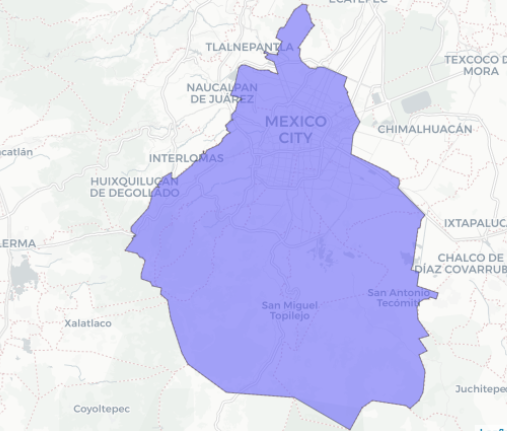

```{r include=FALSE}
#| message: false
library(tidyverse)
library(sf)
library(leaflet)
library(mapview)
library(jsonlite)
library(gt)
```


# Introducción



Ando probando subir documentos/apps a possit connect cloud, así que este tutorial me servirá tanto para compartir como descargar información desde el portal del [INEGI](https://www.inegi.org.mx/servicios/catalogoUnico.html) así como para practicar el proceso para subirlos.

# Librerías

Usaremos las siguientes librerías: tidyverse manipulación de datos, sf para lectura/manipulación de datos espaciales (vectoriales) mapview para una visualización sencilla.

```{r eval=FALSE}
library(tidyverse)
library(sf)
library(mapview)
```

En el portal del INEGI, aparte de sus API'S como DENUE, banco de indicadores y el sistema de Ruteo, podemos obtener directamente datos espaciales de México.

Entre ellos: 

* Areas Geoestadísticas Estatales
* Áreas Geoestadísticas Municipales
* Por ageb
* Por manzana
* Vialidades

Para cada consulta es un link diferente o puede ser el mismo link pero se van agregando parámetros, acá te muestro como generar algunos de forma sencilla, pero puedes ver todos los ejemplos en el portal de servicios web en Guía para desarrolladores en el [Catálogo Único de Claves Geoestadísticas](https://www.inegi.org.mx/servicios/catalogoUnico.html).

## Entidades.

Le información que puedes consultar está tanto en formato tabla(json)/widget/geojson. 
El primere ejemplo (y único) para json leeremos la información de poblacióin a nivel nacional.

```{r}
pob_nal = jsonlite::fromJSON(
  "https://gaia.inegi.org.mx/wscatgeo/v2/mgee/",
  flatten = TRUE
  )
```

Al hacer esta consulta nos devuelve un objeto tipo lista que contiene **datos**, **metadatos**, **numReg**

```{r}
str(pob_nal)
```

* Datos Es la tabla de las entidades con variables de población,
* Metadatos contiene de donde obtuvo la información ("INEGI. Censo de Población y Vivienda, 2020")
* numReg indica la cantidad de registros que nos devolvió (32, por que son 32 entidades)

por default (en json) suelen venir todo en tipo texto, así que pasaremos a numérico las variables y sobreeescribiremos el objeto *pob_nal* y ya podemos ver los Estados son sus variables (por facilidad solo muestro 10)

```{r}
pob_nal = pob_nal$datos %>% 
  mutate(across(c(pob_total:total_viviendas_habitadas),~as.numeric(.)))

pob_nal %>% head(10)
```
Usango gt podemos hacer una tabla sencilla y rápida.

```{r}
pob_nal %>% 
  arrange(desc(total_viviendas_habitadas)) %>% 
  gt() %>% 
    fmt_number(
    columns = c("pob_total":"total_viviendas_habitadas"),
    decimals = 0,
    use_seps = TRUE
  ) %>% 
    data_color(
    columns = total_viviendas_habitadas,
    method = "numeric",
    palette = "viridis"
  ) %>% 
    cols_label_with(
      fn = ~ html(str_to_title(gsub("_", "<br>", .x)))
    )
```

# Datos espaciales

Como puedes ver solo leímos un link y fue sencillo de obtener, no necesitamos ningún token para poder leer la información, pero bueno ahora sí a leer datos espaciales (al fin!) ¿Recuerdas la Guía para desarrolladores? en el [Catálogo Único de Claves Geoestadísticas](https://www.inegi.org.mx/servicios/catalogoUnico.html) cada información que indica, menciona que puedes obtener la información vectorial en formato geojson, puede ser ya sea a nivel nacional o información por Estado municipio, Ageb ,acá presentaremos algunos ejemplos

## Estados

Para leer Una entidad en específico debemos armar un link. de la siguiente forma:

* https://gaia.inegi.org.mx/wscatgeo/v2/geo/mgee/**{cve_ent}** 

Donde dice **cve_ent** es donde se debe reemplazar por un número del 1 al 32 para asignar los Estados, Algunos que me sé de memoria, 1 aguascalientes, el 15 Edo Mex, 09 CDMX,32 Zacatecas etc.. Ojo que la clave del Estado debe ir a dos cifras, o sea si ponemos CDMX tendría que ser "09", Puedes consultar las entidades acá [CATÁLOGO DE ENTIDADES FEDERATIVAS](https://www.agricultura.gob.mx/sites/default/files/sagarpa/document/2018/07/17/8/180717115914/entidades-federativas.pdf) y para hacernos la consulta sencilla lo dividimos en 2, el link_base y el estado que solo se lo pegamos. HAré el ejercicio con la clave 11 (Guanajuato)

Este es el link al que se hará la consulta:

```{r}
link_base = "https://gaia.inegi.org.mx/wscatgeo/v2/geo/mgee/"

paste0(link_base,"11")
```

y con la función st_read() (de la librería sf) leemos el link

```{r}
estado = st_read(
  paste0(link_base,"11"),
  quiet = TRUE
)
```

¿Qué devuelve esta consulta?

Nos regresa los cambios de Nombre del Estado, Población total, femenina, masculina y el total de viviendas habitadas (todo esto del último censo de población del 2020)

```{r}
estado 
```

```{r}
mapview(estado)
```

